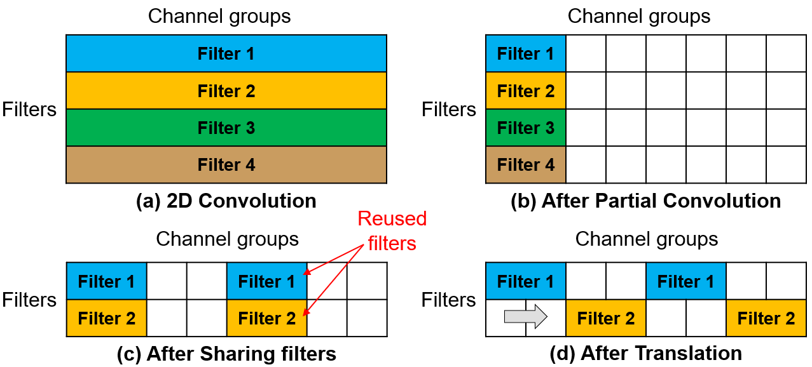

# Flexible Convolutional Neural Network (FCNN)
## Overview
### Overview of FCNN
<p align="center">
    
</p>
Flexible Convolutional Neural Network (FCNN) is an efficient convolutional neural network (CNN)
that includes Flexible Convolution (FConv) which improves the efficiency of 2D convolutions.
Figure (a) shows the filers and their receptive fields across input channel groups of a conventional 2D convolution.
FCNN improves the efficiency of 2D convolution by applying the following ideas. 

**(I1) Partial convolution (Figure (b)):**
we reduce the number of parameters and FLOPs by using only part of channel groups as a receptive field of each filter.


**(I2) Sharing filters (Figure (c)):**
we reduce the number of parameters via sharing filters in CNN.
We use different channel groups for shared filters.


**(I3) translation (Figure (d)):**
we improve the accuracy of the model by translating the receptive field of filters.
A diversified combination of channel groups improves the accuracy of the compressed model.

### Code Description
This repository is written based on the codes in the [GitHub](https://github.com/weiaicunzai/pytorch-cifar100).
Here's an overview of our codes.

``` Unicode
FCNN
  │
  ├──  src    
  │     ├── train.py: codes for training neural networks
  │     ├── test.py: codes for testing a trained neural networks
  │     ├── utils.py: codes for utility functions
  │     └── models
  │          ├── fcnn.py: implementation of FConv and FCNN
  │          └── resnet.py: implementation of ResNet34 
  │     
  ├──  scripts: a directory for script files
  │     ├── train.sh: a script for training neural networks
  │     ├── train_teacher.sh: a script for training ResNet34 model for a teacher model
  │     └── test.sh: a script for testing neural networks  
  │     
  ├── requirements.txt: a list of dependencies
  └── README.md

```

## Prerequisite
### Install dependencies
List of dependencies are as follows.
* python>=3.8
* torch 1.12.1
* torchvision 0.13.1
* tqdm 4.64.1
* numpy 1.23.4
* PyYAML>=5.1

Install torch and torchvision according to your CUDA version following the 
[url](https://pytorch.org/get-started/previous-versions/)
, and then install other dependencies using the following command.
```
pip install -r requirements.txt
```

### Checkpoint of a teacher model
You need to train a teacher model if you want to use knowledge distillation.
Run the following code to train ResNet34 model as a teacher model.
```
bash scripts/train_teacher.sh
```


### Datasets
Our code automatically downloads the dataset for a target task when you run our main file.
You don't have to prepare the dataset manually.

## Running
### Key arguments of FCNN
* net: network type, either resnet34 or fcnn34
* gpu: whether use gpu or not
* b: batch size for dataloader
* lr: inital learning rate
* teacher: a path for a pretrained teacher model
* alpha: balance coefficient for knowledge distillation
* tau: a temperature for softmax functions in knowledge distillation
* nu: the number of output channels generated by each filter
* rho: the ratio of the width of a receptive field of a filter and the number of input channels

### Codes for running FCNN
The following code is an example of training FCNN version of ResNet34.
```
GPU=0
NET=fcnn34
RHO=6
NU=2
cd src/
CUDAVISIBLE_DEVICES=$GPU python train.py -net $NET -rho $RHO -nu $NU -gpu
```
We provide the code for training FCNN as scripts/train.sh.
Run the script file as follows.
```
bash scripts/train.sh
```

If you want to use knowledge distillation, run following codes.
Fill in the path of a pretrained ResNet34 in the TEACHER variable. 
```
GPU=0
NET=fcnn34
RHO=6
NU=2
ALP=0.9
TAU=10
TEAHCER={Your-ResNet34-model-path}
cd src/
CUDAVISIBLE_DEVICES=$GPU python train.py -net $NET -rho $RHO -nu $NU -gpu \
                                         -teacher $TEACHER -alpha $ALP -tau $TAU 
```

Test your trained checkpoints using the following code.
Fill in the path of a trained model in the WEIGHT variable.
```
GPU=0
NET=fcnn34
RHO=6
NU=2
WEIGHTS={Your-model-path}
cd src/
CUDAVISIBLE_DEVICES=$GPU python test.py -net $NET -rho $RHO -nu $NU -gpu \
                                         -weights $WEIGHTS 
```
We provide the code for testing trained models as scripts/test.sh.
Run the script file as follows.
```
bash scripts/test.sh
```

## Reference
* GitHub repository: [https://github.com/weiaicunzai/pytorch-cifar100](https://github.com/weiaicunzai/pytorch-cifar100)
